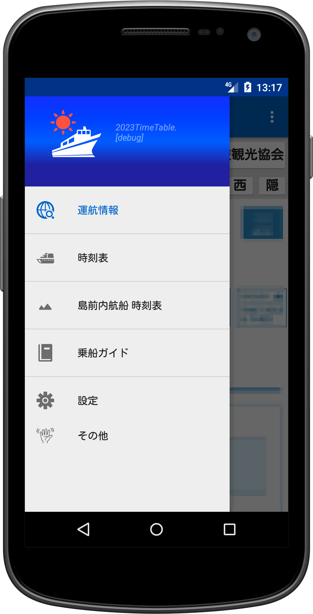
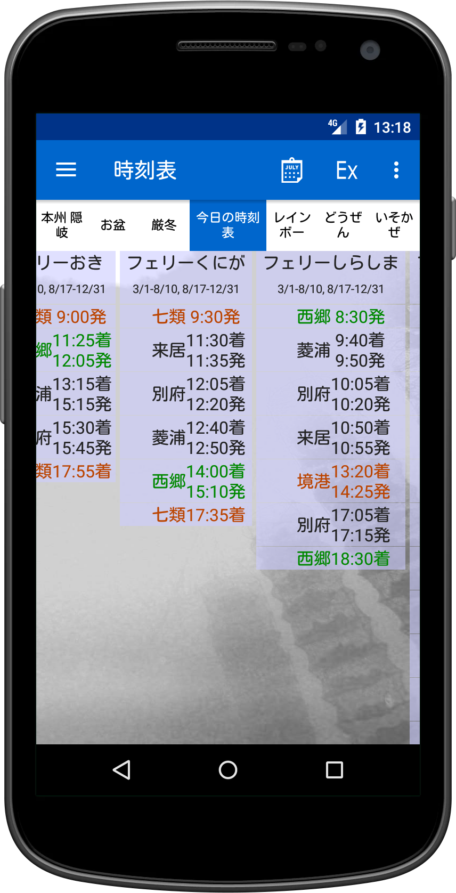
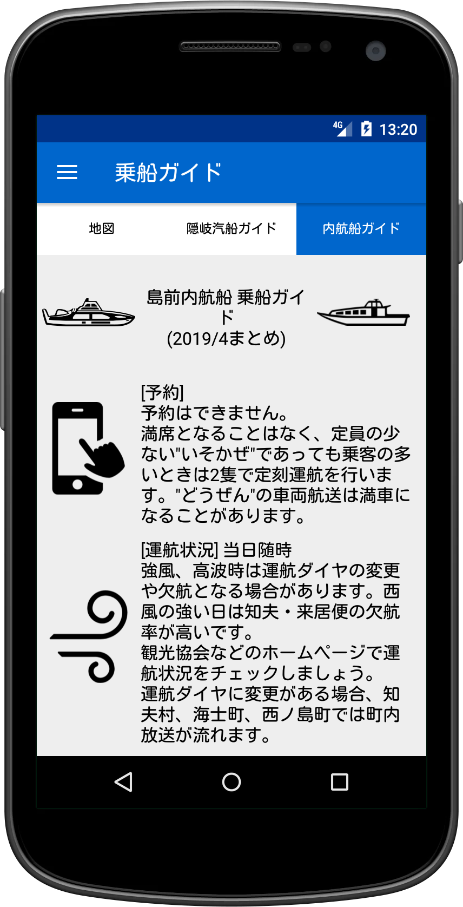

# 隠岐航路時刻表

  
  
  

[Read the English README](README.md)

## 概要

隠岐航路時刻表は、島根県の隠岐諸島を結ぶ航路情報に特化したAndroidアプリです。
隠岐汽船フェリー・高速船レインボージェット・隠岐観光の島前連絡船の運航状況や時刻表を簡単に確認できます。
特に 知夫・海士・西ノ島 の住民および観光客の利用を想定して設計されています。

**注記**: 本アプリは運航会社が提供する公式アプリではありません。

## 主な機能

-   リアルタイム運航情報の確認
    アプリ内から当日の運航状況を即時に確認可能。

-   柔軟な時刻表フィルタ
    船種・路線・日付・車両航送などで絞り込み可能。

-   今すぐ乗れる便の検索
    現在時刻をもとに、本日これから利用可能な便を素早く提示。

-   島前の乗り換えサポート
    複数航路にまたがる乗り換え対応時刻表を提供。

-   ガイド機能
    島名の読み方、港の駐車場、車両航送方法など、乗船に必要な情報を事前に確認可能。

-   最新時刻表を自動ダウンロードして常に更新
    アプリ起動時に必要に応じて最新の時刻表を自動取得します。常に最新の情報で利用できます。

-   オフライン対応
    一度ダウンロードした時刻表は、圏外でも閲覧可能。

-   複数のテーマと文字サイズに対応
    見やすさを重視したカスタマイズ機能付き。

## インストール

1. [`Oki Ferries 2025 Unlimited github.apk`](Oki%20Ferries%202025%20Unlimited%20github.apk)をダウンロードします。
2.  ダウンロードしたAPKファイルをAndroidデバイスにコピーします。
3.  Androidデバイス上でAPKファイルを開き、インストールを実行します。
    -   デバイスの設定で不明なアプリのインストールを許可する必要がある場合があります。

## ライセンス

-   このソフトウェアは無償で利用可能です。

## 連絡先

-   [https://okiislandsh.blogspot.com/]

## 免責事項

-   このソフトウェアは現状有姿で提供され、明示または黙示を問わず、いかなる保証も提供しません。
-   作者は、本ソフトウェアの使用によって生じた、いかなる損害、損失、不利益についても、一切の責任を負いません。作者は完全な免責となります。
