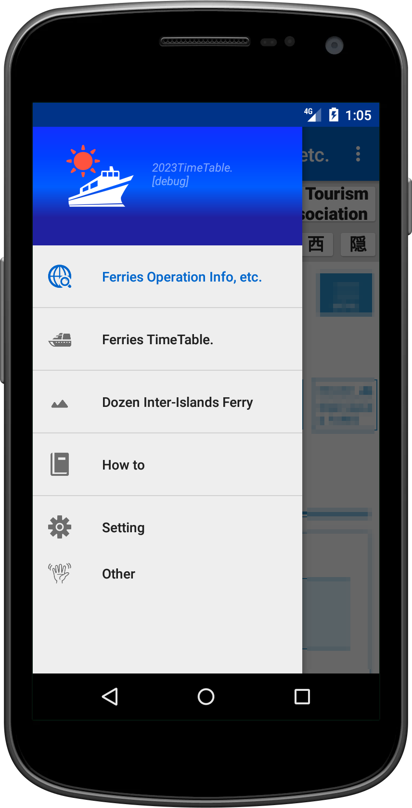
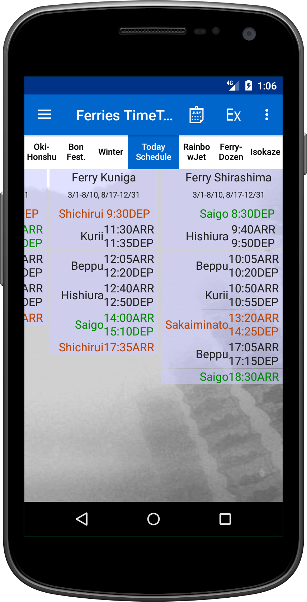
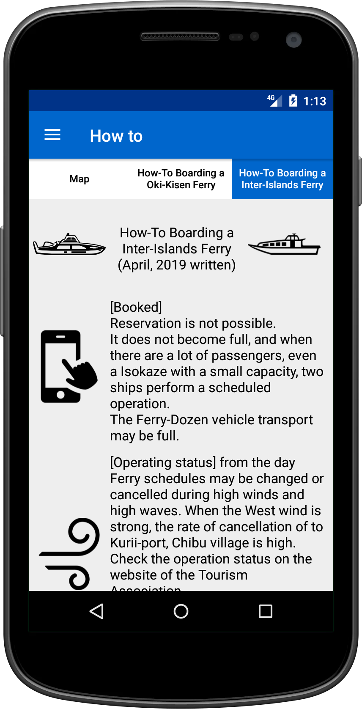

# Oki Ferries – Ferry Timetable for Oki Islands

  
  
  

[日本語ReadMe](README.ja.md)

## Overview
Oki Ferries is an Android app dedicated to providing ferry route information for the Oki Islands in Shimane Prefecture, Japan.

It covers real-time operations and timetable filtering for:
Oki Kisen ferries
Rainbow Jet (super high-speed boat)
Inter-island shuttle ships (Dōzen area)
This app is especially designed for local residents (notably Chibu, Ama, Nishinoshima) and travelers visiting the islands.

**Note**: Please note that this app is not an official product of any ferry or transport company.

## Key Features

-   Check live ferry operation status
    Quickly confirm cancellations or changes from within the app.

-   Timetable filtering
    Filter by route, vessel type, operating period, or vehicle transport options.

-   Find today's available ferries
    Instantly view ferries you can still catch today based on current time.

-   Inter-island transfer support
    View combined transfer schedules for connections across multiple islands.

-   Travel guide integration
    Includes pronunciation of island names, port parking information, and car ferry transport instructions.

-   Always up-to-date timetables via automatic download
    The app automatically fetches the latest timetable data when needed, ensuring accurate and current information.

-   Offline access
    Once downloaded, timetables are accessible without internet connectivity.

-   Customizable display
    Multiple font sizes and color themes for better readability.

## Installation

1. Download the [`Oki Ferries 2025 Unlimited. Reduced Services from June 2025. github.apk`](Oki%20Ferries%202025%20Unlimited.%20Reduced%20Services%20from%20June%202025.%20github.apk).
2.  Copy the downloaded APK file to your Android device.
3.  Open the APK file on your Android device and perform the installation.
    -   You may need to allow the installation of apps from unknown sources in your device's settings.

## License

-   This software is free to use.

## Contact

-   [https://okiislandsh.blogspot.com/]

## Disclaimer

-   This software is provided "as is" without any warranty, express or implied.
-   The author is not responsible for any damages, losses, or disadvantages caused by the use of this software. The author is completely exempt from liability.
